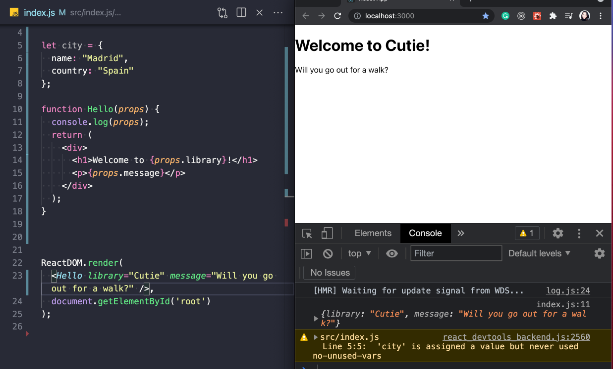
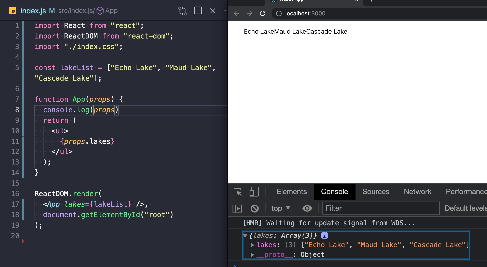
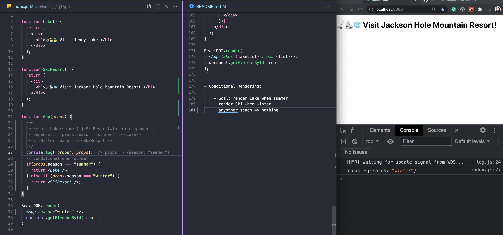
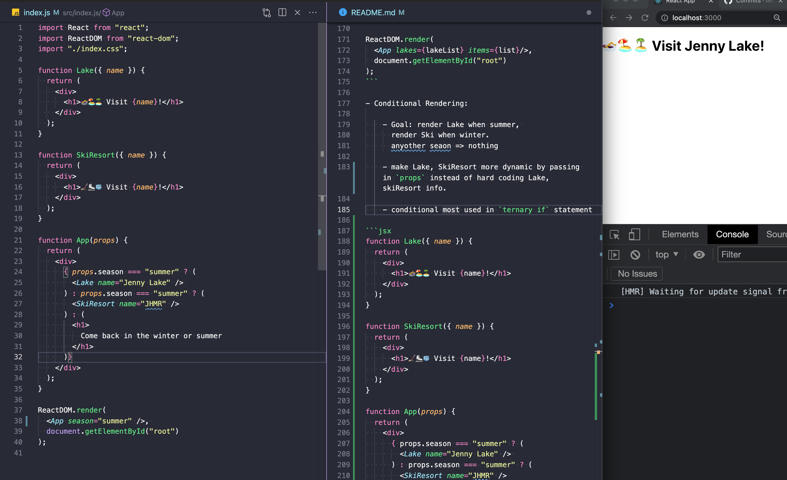
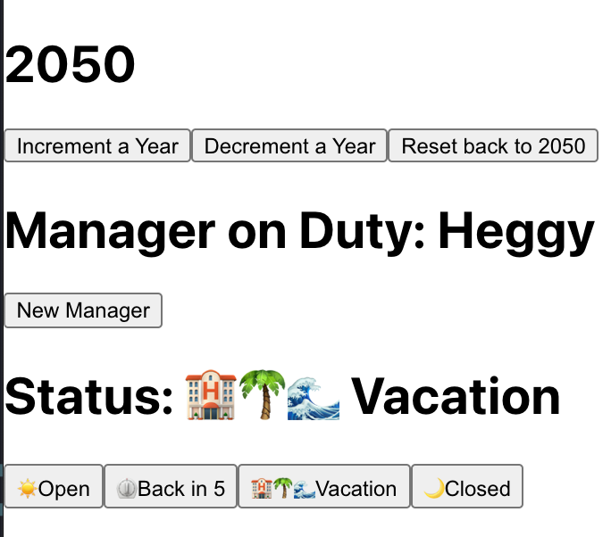
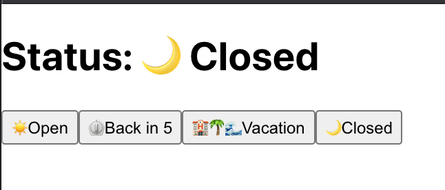

# intro react

## passing props



```jsx
function Hello(props) {
  console.log(props); // {library: "Cutie", message: "Will you go out for a walk?"}
  return (
    <div>
      <h1>Welcome to {props.library}!</h1>
      <p>{props.message} {props.number}</p>
    </div>
  );
}

ReactDOM.render(
  <Hello 
    library="Cutie" 
    message="Will you go out for a walk?"
    number={3}
  />,
  document.getElementById('root')
);
```


- Component Lake that print out the props.name

```jsx
function Lake(props) {
  return (
    <h1>{props.name}</h1>
  )
}

// or after obj destructuring
function Lake({name}) {
  return (
    <h1>{name}</h1>
  )
}

function App() {
  return (<div>
    <Lake name="Lake Tahoe" />
    <Lake name="Angora Lake" />
    <Lake name="Shirley Lake" />
  </div>);
}

ReactDOM.render(
  <App />,
  document.getElementById('root')
);
// =>
// Lake Tahoe
// Angora Lake
// Shirley Lake

```

- Passing prop of lakeList array



```jsx
const lakeList = ["Echo Lake", "Maud Lake", "Cascade Lake"];

function App(props) {
  console.log(props); // => { lakes: ["Echo Lake", "Maud Lake", "Cascade Lake"] }
  return (
    <ul>
      {props.lakes}
    </ul>
  );
}

ReactDOM.render(
  <App lakes={lakeList} />, 
  document.getElementById("root")
);
```

```jsx
// refactor and add in <li> with map loop thru 

const lakeList = ["Echo Lake", "Maud Lake", "Cascade Lake"];

function App({ lakes }) {

  return (
    <ul>
      {lakes.map((lake, index) => <li key={index}>{lake}</li>)}
    </ul>
  );
}

ReactDOM.render(
  <App lakes={lakeList} />, 
  document.getElementById("root")
);
```
- Dynamically Loop thru object
```html
// => goal
<div>
  <div>
    <h2>Echo</h2>
    <p>Accessed by: Echo</p>
  </div>
  <div>...</div>
</div>
```

```jsx
// code
const lakeList = [
  {id: "1", name: "Echo", trailhead:"Echo"},
  {id: "2", name: "Maud", trailhead:"Wright"},
  {id: "3", name: "Velma", trailhead:"Wright"}
];

function App({ lakes }) {
  return (
    <div>
      {lakes.map(lake => (
        <div key={lake.id}>
          <h2>{lake.name}</h2>
          <p>Accessed by: {lake.trailhead}</p>
        </div>
      ))}
    </div>
  );
}

ReactDOM.render(
  <App lakes={lakeList} />, 
  document.getElementById("root")
);
```

- Array of number use .toString() to convert the number to string to assign child element key value.

```js
<li key={item.toString()}>{item}</li>
```

```jsx

const list = [1, 2, 3, 4, 5];

function App({ lakes, items }) {
  // console.log('props', props);
  return (
    <div>
      {items.map(item => (
        <li key={item.toString()}>{item}</li>
      ))}
      {lakes.map(lake => (
        <div key={lake.id}>
          <h2>Lake: {lake.name}</h2>
          <p>Accessed by: {lake.trailhead}</p>
        </div>
      ))}
    </div>
  );
}

ReactDOM.render(
  <App lakes={lakeList} items={list}/>, 
  document.getElementById("root")
);
```

- Conditional Rendering:

    - Goal: render Lake when summer, 
      render Ski when winter.
      anyother seaon => nothing

    - make Lake, SkiResort more dynamic by passing in `props` instead of hard coding Lake, skiResort info.

    - conditional most used in `ternary if` statement
    ```jsx
    if summer => <Lake name="Jenny Lake" />
    if winter => <SkiResort name="JHMR" />
    // otherwise
    <h1>
      Come back in the winter or summer
    </h1> 
    ```

```jsx
function Lake({ name }) {
  return (
    <div>
      <h1>🏊‍♀️🏖🏝 Visit {name}!</h1>
    </div>
  );
}

function SkiResort({ name }) {
  return (
    <div>
      <h1>🏒⛸🧊 Visit {name}!</h1>
    </div>
  );
}

function App(props) {
  return (
    <div>
      { props.season === "summer" ? (
        <Lake name="Jenny Lake" /> 
      ) : props.season === "summer" ? (
        <SkiResort name="JHMR" /> 
      ) : (
        <h1>
          Come back in the winter or summer
        </h1> 
      )}
    </div>
  );
}

ReactDOM.render(
  <App season="fall" />, 
  document.getElementById("root")
);
```




- [ternary code](https://gist.github.com/heggy231/5caba4b3909b4c41df7cafde58cc1141)


- React.Fragment short hand => `<> </>` or `<React.Fragment></React.Fragment>`

### Array destructuring: create variable for each i of array

```js
var food = [
  'candy',
  'veggie',
  'rice'
];

food[0] // candy
food[1] // veggie
food[2] // rice

// Each place i gets a variable
// array destructuring creating variable for each index of array 
const [ first, second, third ] = [ 'candy', 'veggie', 'rice' ];
first // candy
second // veggie
third // rice

```
[code for array destructuring](https://gist.github.com/heggy231/2f671831f5469ea48e003617b4db6c45)

### hooks

## { useState } hook



```js
// initial state of status is "Open"
// second value we get return from useState 
//   is setStatus
const [ status, setStatus ] = useState("Open");
```

- change status using useState



```js
function App() {
  const [ status, setStatus ] = useState("Open");
  return (
    <div>
      <h1>Status: {status}</h1>
      <button onClick={() => setStatus("☀️ Open")}>
        ☀️Open
      </button>
      <button onClick={() => setStatus("⏲ Back in 5")}>
        ⏲Back in 5
      </button>
      <button onClick={() => setStatus("🏨🌴🌊 Vacation")}>
        🏨🌴🌊Vacation
      </button>
      <button onClick={() => setStatus("🌙 Closed")}>
        🌙Closed
      </button>
    </div>
  );
}

ReactDOM.render(
  <App />, 
  document.getElementById("root")
);

```

- Set multiple state `{ useState }`:

```jsx
import React, { useState } from "react";
import ReactDOM from "react-dom";
import "./index.css";

function App() {
  const [year, setYear] = useState(2050);
  const [manager, setManager] = useState("Alex");
  const [ status, setStatus ] = useState("Open");
  return (
    <>
      <div>
        <h1>{year}</h1>
        <button onClick={() => setYear(year + 1)}>
          Increment a Year
        </button>
        <button onClick={() => setYear(year - 1)}>
          Decrement a Year
        </button>
        <button onClick={() => setYear(2050)}>
          Reset back to 2050
        </button>
      </div>
      <div>
        <h1>Manager on Duty: {manager}</h1>
        <button onClick={() => setManager("Heggy")}>
          New Manager
        </button>
      </div>
      <div>
        <h1>Status: {status}</h1>
        <button onClick={() => setStatus("☀️ Open")}>
          ☀️Open
        </button>
        <button onClick={() => setStatus("⏲ Back in 5")}>
          ⏲Back in 5
        </button>
        <button onClick={() => setStatus("🏨🌴🌊 Vacation")}>
          🏨🌴🌊Vacation
        </button>
        <button onClick={() => setStatus("🌙 Closed")}>
          🌙Closed
        </button>
      </div>
    </>
  );
}

ReactDOM.render(
  <App />, 
  document.getElementById("root")
);
```

### Checkbox project:

- Incorporate useState()

- Set checked as state variable

- state value initially set to false

- JSX expression: check if box is checked (true) or not

- input checkbox set `onChange` when state of checkbox is changed

- Toggle if it is checked => make it not checked vice versa.

- Function gets called regardless what is happening in the dom when just dealing with `useState(false)` for checked or not.  This is good spot to use `useEffect`.
```jsx
function Checkbox() {
  const [checked, setCheckbox] = useState(false);
  // alert gets called before component is rendered.
  alert(`checked: ${checked.toString()}`);
  return (
    <>
      <input 
        type="checkbox"
        value={checked} 
        onChange={() => setCheckbox( checked => !checked )}
      />
      { checked ? "checked" : "not checked" }
    </>
  );
}
```

- `useEffect` allows perform "side effects" inside of function components.

    * side-effect (https://dmitripavlutin.com/react-useeffect-explanation/)
      Ex) of side-effects: 
      - fetch request, 
      - manipulating DOM directly, 
      - using timer functions like setTimeout()

```jsx
function Greet({ name }) {
  const message = `Hello, ${name}!`; // calc Output

  // BAD!  perform side-effects directly in the body of the component. sets title inside of head html
  alert(document.title); // => react app
  document.title = 'KDrama';
  alert(`after change title: ${document.title}`)  // => KDrama then the component finally shows "Hello, Heggy!"

  return (
    <div>
      {message}
    </div>
  );
}

ReactDOM.render(
  <Greet name="Heggy" />, 
  document.getElementById("root")
);
```

- How to decouple rendering from the side-effect?
    * `useEffect()` -- the hook that runs side-effects independently of rendering
    * `useEffect()` accepts 2 arguments:
      `useEffect(callback[, dependencies]);`
        - `callback` is the cb fx containing side-effect logic.  `useEffect() executes the cb fx after React has committed the changes to the screen.

    * Warning: The component rendering and side-effect logic are independent. So it would be a mistake to perform side-effects directly in the body of the component.

    How often the component renders isn’t something you can control — if React wants to render the component, you cannot stop it.